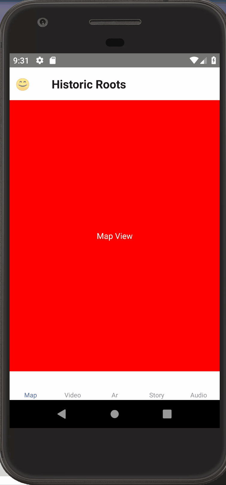

# capstone497
Repository for Senior Seminar Capstone

# Installing and running

Follow the instuctions here: https://facebook.github.io/react-native/docs/getting-started.html on the tab "Building Projects with Native Code", not "Quick Start"

I created this on Windows and built it only for Android, not OSX and iOS, but testing will follow for that. If you're on Mac, I'd recommend going through the Mac + Android installation instructions. Get Android Studio here: https://developer.android.com/studio/archive and I'd recommend 3.0, but 3.1 should also work, don't go for the latest versions. To run the app in the simulator for Android, you'll need to follow these directions here: https://developer.android.com/studio/run/managing-avds to create an emulator on your machine. Create one that's running the latest android version.

After you have React Native installed, in your project directory, run this:

`npm install`

which will install all the dependencies you need to run the app.

After that's done, open Android Studio (as admin on PC), and start your emulator. Then in your command line, run `react-native run-android`. This should start the app in your emulator. You might run into errors, this happens somewhat frequently (particularly in Android development) and you'll have to Google how to sort them out.

